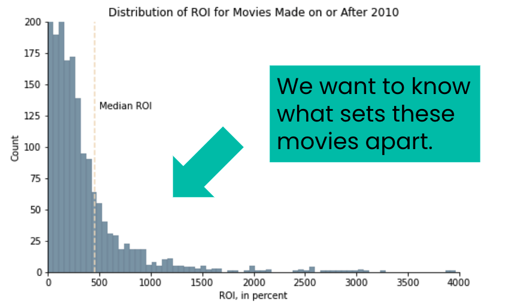
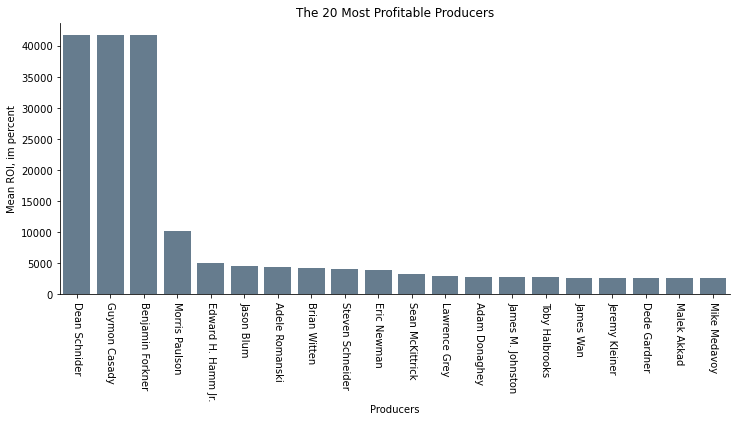
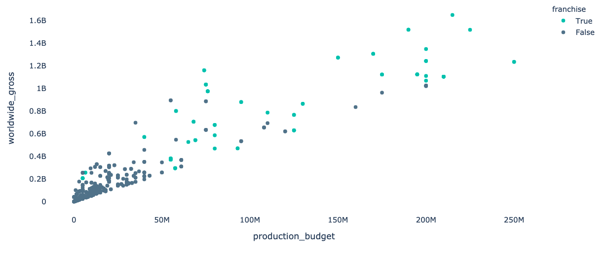

# Ensuring Success for Microsoft Movie Studios


## Business Problem

What types of movies should Microsoft Movie Studios make in order to maximize the return on investment?




## Business Value

A significant amount of time and money goes into the production of a movie. These resources are best allocated to the movie genres, crew and markets that are associated with a greater return on investment (ROI) in terms of box-office revenue. By focusing on creating and releasing movies that have a greater chance of being financially successful, Microsoft Movie Studios can maximize profits.

## Questions to Investigate

- Which movie genres have the highest ROI?
- Do movies released at a certain time of year have a higher ROI?
- What directors and producers have demonstrated profitability?
- Do movies that are part of a franchise have a higher gross?
- What external markets can increase profits?

## Methodology

- Analyze box-office data on released movies
- Look for characteristics of movies with a high ROI
- Make data-driven recommendations to create high-ROI movies

## Findings

### Genre

#### Mystery, horror, animation, science fiction and adventure all have a greater ROI than the median.

Adventure movies are by far the most popular, with about double the number released each year compared to the other top genres. This genre has a consistent ROI of around 250%, which is about average. However, they are also the most expensive to produce, which introduces an element of risk.

Mystery has a 38% improvement on ROI, but popularity trends suggest that it may be losing interest for viewers.

Horror and science fiction have a high ROI (27% and 16% improvements, respectively) and seem to be increasing in both popularity and profitability. Science fiction is expensive to create, while horror has extremely low production costs.

Animation is a consistent performer (about 23% improvement on baseline ROI), but is also expensive to produce.


####  Adventure movies are the most popular.


#### Adventure movies are expensive to make & horror movies have among the lowest production budgets.


### Season of Release


#### Movies released in the summer have the greatest ROI.


The movies with the highest ROI are released in in the summer, with the three other seasons being approximately equal, giving credence to the idea of a "summer blockbuster."

#### Horror ROI peaks in the fall and science fiction peaks in the winter.


### Directors & Producers

We all know that the "big name" actors tend to draw a crowd, but they also draw a big paycheck. I am going to look instead at the directors and producers that have been linked to highly profitable movies.

#### Certain directors are both prolific, meaning they have made many movies, and profitable, meaning their movies had a high ROI.


The two directors with the extremely high ROI both worked on The Gallows, a very low-budget horror movie that happened to do extremely well at the box office. This type of return cannot be expected again.

Jordan Peele and William Brent Bell are both prolific and profitable, making them wise choices for movie production.
     
#### Some producers are associated with high ROI movies.



### Franchises 

#### Most high-budget films that have a high ROI are part of a franchise. 

By observation - and life experience - it is clear that many of the most profitable movies are part of a franchise.



The graph shows that most of the big-budget, big profit movies are indeed part of franchise. 

### Global Markets

#### Brazil, Russia, Germany & Spain are high consumers of American-made movies.

One of the ways that a movie can make more profit is by exporting it to other markets with slight modifications. The following are the top markets for American-made movies in the top 20% of ROI.


## Recommendations

### Focus production on movies in the adventure, horror and science fiction genres because they have a high ROI and are popular. If budget is limited, emphasize horror movies, as they have a higher return than average and a much lower production cost.

### Focus on summer releases, especially for big-budget adventure movies because summer has the overall highest ROI and is when the ROI for adventure peaks. Release horror movies in the fall and science fiction in the winter to coincide with their best ROI.

### Create opportunities to hire Jordan Peele or William Brent Bell as directors because they are popular and have directed movies with a high ROI. Consider Dean Schnider, Guymon Casady or Benjamin Forker as producers since they have produced profitable movies.

### Look for opportunities for movie franchises, especially for big-budget productions.

### Customize high-performing movies for the following global markets: Brazil, Russia, Germany & Spain.


## Future Work

- Streaming has become increasing popular and has dramatically altered the movie environment. Further research into streaming markets to determine what movies are most profitable in that domain would be highly beneficial.

- Examine data from 2020-2021 to see the impact that Covid had on movie trends, as some of these may have a lasting impact on the market.

- Obtain more thorough data on the expenses in movie production in order to calculate more accurate ROI statistics.


```python

```


```python

```
